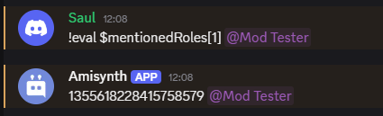

# $mentionedRoles[]

Devuelve el ID del rol mencionado.

**Sintaxis**
```
$mentionedRoles[Número de mención]
```

**Parámetros**
- `Número de mención` `(Tipo: HowMany || Marca: Obligatorio)`: La mención del rol que se obtiene del mensaje del autor (`1` = primera mención del rol, `2` = segunda, etc.).

**Ejemplo**
```
$eval[$message[-1]]
```

