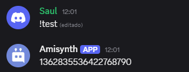

# $messageID[]

Devuelve el ID del mensaje del autor.

> 📝 Si se escribe `$messageID[]` en los comandos `$onInteraction`, devolverá el ID del mensaje del bot.

**Sintaxis**
```
$messageID[]
```

**Ejemplo**
```
$messageID[]
```

