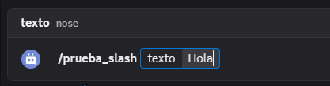
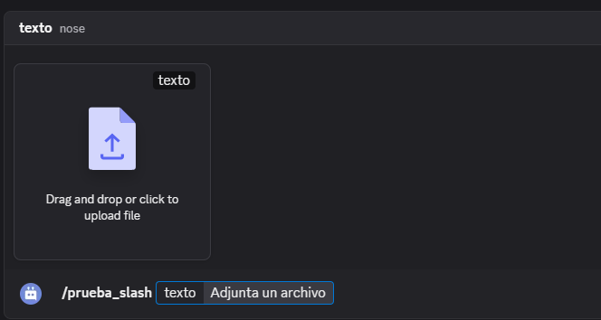

# $messageSlash[]

Devuelve el mensaje del usuario *(sin el disparador de comando)*.

**Sintaxis**
```
$messageSlash[Opcion]
```

- `Opcion`: `(Tipo: Texto || Marca: Obligatorio)`: Obtiene el contenido que se le pasa por la opcion.

**Ejemplo**
```
$messageSlash[texto]
```





