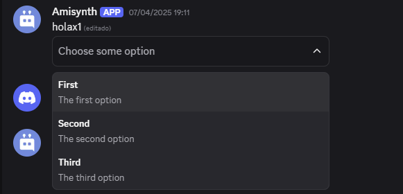

# $newSelectMenu
Añade un menú de selección a un mensaje.

**Sintaxis**
```
$newSelectMenu[ID del menú; Mín; Máx; (Marcador de posición; ID del mensaje)]
```

**Parámetros**
- `ID del menú` `(Tipo: Cadena || Marcador: Obligatorio)`: El ID del menú que se utiliza en la devolución de llamada `$onInteraction[]` y dentro del primer argumento de `$addSelectMenuOption[]`.

- `Mín` `(Tipo: Entero || Marcador: Obligatorio)`: La cantidad mínima de valores que se pueden seleccionar.

- `Máx` `(Tipo: Entero || Marcador: Obligatorio)`: La cantidad máxima de valores que se pueden seleccionar.

- `Marcador de posición` `(Tipo: Cadena || Marcador: Vacante)`: El texto que aparece si no se selecciona ninguna opción. - `ID del mensaje` `(Tipo: Copo de nieve || Marca: Vacante)`: El ID de un mensaje al que se le debe añadir un menú de selección. Por defecto, es la respuesta del bot.

**Ejemplo**
```
Holax1
$newSelectMenu[Ejemplo;1;1;Elige una opción]
$addSelectMenuOption[Ejemplo;Primero;primera opción;La primera opción]
$addSelectMenuOption[Ejemplo;Segundo;segunda opción;La segunda opción]
$addSelectMenuOption[Ejemplo;Tercero;tercera opción;La tercera opción]
```


> Para más información, consulta la [Guía del Menú Select](../gen/selectmenu.md.md).