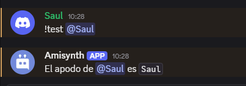

# $nickname[]

Devuelve el apodo del usuario.

> 🧙‍♂️ "Apodo" se refiere al apodo del usuario en el servidor. Si el usuario no tiene apodo, se devuelve su nombre para mostrar.

**Sintaxis**
```
$nickname[(ID de usuario)]
```

**Parámetros**

- `ID de usuario` `(Tipo: Copo de nieve || Marca: Opcional)`: El usuario del que se obtendrá el apodo.

**Ejemplo**

```
El apodo de <@$mentioned[1]> es `$nickname[$mentioned[1]]`
```

