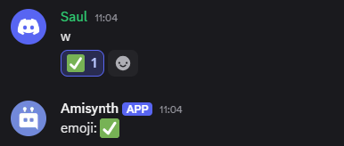

# $reationEvent[]
La función `$reactionEvent[]` almacena un valor en una variable temporal dentro de la ejecución del comando.  

### `Sintaxis`  
```plaintext
$reactionEvent[]
```
> Esta es una funcion compartida que retornar el emoji usado o removido en los eventos `$onReactionAdd` y `$onReactionRemove`

### `Ejemplo`  
```plaintext
$reactionEvent[]
```

