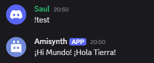

# $replaceText[]

Reemplaza "Muestra" por "Nueva" de "Texto". Puedes elegir cuántas "Muestras" se reemplazan introduciendo "Cantidad".

**Sintaxis**
```
$replaceText[Texto;Muestra;Nueva;(Cantidad)]
```

**Parámetros**
- `Texto` `(Tipo: Cadena || Marca: Vaciable)`: El texto donde el bot busca la "Muestra".

- `Muestra` `(Tipo: Cadena || Marca: Vaciable)`: El texto que se reemplazará por "Nueva".

- `Nuevo` `(Tipo: Cadena || Marca: Vaciable)`: El texto que se reemplazará por "Muestra".

- `Cantidad` `(Tipo: Entero || Marca: Opcional)`: El número máximo de veces que el bot debe reemplazar la muestra. Usa `-1` para reemplazar todas las "Muestras" de "Texto" por "Nueva".

**Ejemplos**

**Ejemplo 1:**
- Entrada: `$replaceText[¡Hola Mundo! ¡Hola Tierra!;Hola;Hi;1]`

- Salida: `¡Hola Mundo! ¡Hola Tierra!`

    

**Ejemplo 2:**

- Entrada: `$replaceText[¡Hola Mundo! ¡Hola Tierra! ¡Hola Perro!;Hola;Hi;-1]`

- Salida: `¡Hola Mundo! ¡Hola Tierra! ¡Hola Perro!`

    


    