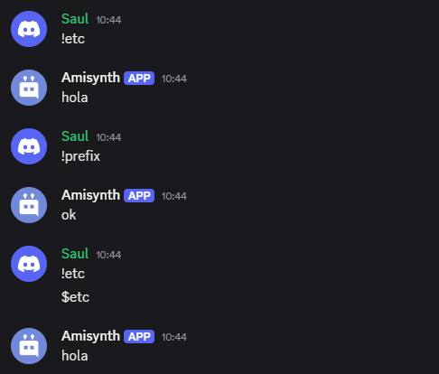

# $setPrefix[]

Establece el nuevo prefijo del bot por servidor.

**Sintaxis**

```
$setPrefix[Prefijo;(ID de servidor)]
```

**Argumentos**

- `Prefijo`  `(Tipo: Copo de nieve || Marca: Obligatorio)`: Establece el nuevo prefijo del bot al servidor unicamente.

- `ID del servidor` `(Tipo: Copo de nieve || Marca: Opcional)`: El servidor al que se asignará el nuevo valor. Si no se proporciona ningún "ID del servidor", se utiliza el servidor actual.


**Ejemplos**

```python
bot = AmiClient("!")

bot.new_command(name="etc", 
                type="text",
                code="""hola""")

bot.new_command(nane="prefix",
                type="text",
                code"""ok $setPrefix[$;$guildID[]]""")

bot.run(..)
```


