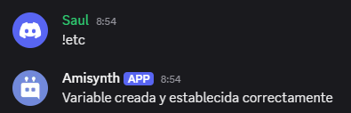

# $setUserVar[]

Crea y Actualiza el valor de una variable para un usuario.

**Sintaxis**
```
$setUserVar[Nombre de la variable;Nuevo valor;(ID de usuario;ID del servidor)]
```

**Parámetros**
- `Nombre de la variable` `(Tipo: Cadena || Marca: Obligatorio)`: La variable que se actualizará.

- `Nuevo valor` `(Tipo: Cadena || Marca: Vaciable)`: El nuevo valor de la variable.

- `ID de usuario` `(Tipo: Copo de nieve || Marca: Opcional)`: El usuario al que se asignará el nuevo valor. Si no se proporciona el "ID de usuario", se usa el autor.

- `ID del servidor` `(Tipo: Copo de nieve || Marca: Opcional)`: El servidor al que se asignará el nuevo valor. Si no se proporciona el "ID del servidor", se usa el gremio actual.

> 📝 Los valores de las variables de usuario tienen no tienen limite caracteres!


**Ejemplo**

```python
Variable creada y establecida correctamente
$setUserVar[dinero;0;$authorID[]]
```




> Para más información, consulta la [Guía de Variables](../gen/variables.md).