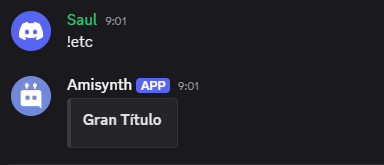

# $title[]

Agrega un título incrustado al mensaje de respuesta del bot.

Sintaxis
```
$title[Texto;(Índice)]
```

**Parámetros**

- `Texto` (Tipo: Cadena || Marca: Vaciable): El texto que se usará para el título. No puede superar los 256 caracteres.
- `Índice` (Tipo: Entero || Marca: Opcional): El índice de inserción al que debe pertenecer el título (predeterminado: 1).

**Permisos**

Permisos necesarios que el bot debe tener para que esta función funcione correctamente:

- sendmessages
- sendmessagesinthreads
- embedlinks

**Ejemplo**

```
$title[Gran Titulo]
```


