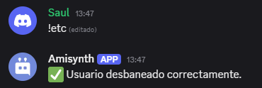

# $unban[]

Desbanea a un usuario del servidor utilizando su ID.  
Permite restaurar el acceso al servidor a un usuario previamente baneado.


## Sintaxis 
```
$unBan[ID del usuario]
```


### Parámetros

- `ID del usuario` `(Tipo: Entero || Indicador: Obligatorio)`: El ID del usuario que será desbaneado del servidor.

### Ejemplo
```
$argsCheck[>1;❌ Uso incorrecto. Uso: `!unban (ID del usuario)`]
$unBan[1105238336328708168]
✅ Usuario desbaneado correctamente.
```


> El bot debe tener el permiso `Ban Members` para ejecutar esta acción.  
> Asegúrate de que el ID ingresado corresponde a un usuario actualmente baneado del servidor.  
> Si el ID es inválido o el usuario no está baneado, la acción puede fallar o devolver un error.

> Esta función es útil para automatizar la gestión de sanciones y restaurar miembros con comandos personalizados.

