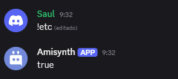

# $urlValid[]

Verifica si una URL proporcionada es válida según el formato estándar de direcciones web.

> Esta función evalúa si una cadena cumple con la estructura de una URL correctamente formada. Esto incluye el protocolo (como `http://` o `https://`), el dominio, y opcionalmente la ruta, los parámetros y el puerto. Es útil para validar entradas del usuario o asegurar que una URL puede ser utilizada correctamente por sistemas o peticiones web.

## Sintaxis
```
$urlValid[URL]
```

### Parámetros

- `URL` `(Tipo: Cadena || Requerido)`: Cadena que se desea validar como una URL.

### Uso común

- Validar enlaces ingresados por el usuario.
- Prevenir errores al hacer solicitudes HTTP con URLs mal formadas.
- Comprobar enlaces antes de procesarlos o almacenarlos.

### Resultado

- Retorna `true` si la URL es válida.
- Retorna `false` si la URL no tiene un formato válido.
### Ejemplo

```
$urlValid[https://google.com]
```
