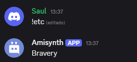

# $userBadges[]

Devuelve una lista de insignias oficiales (badges) del usuario de Discord, separadas por el texto definido.

## Sintaxis
```
$userBadges[ID del usuario; Separador]
```


### Parámetros

- `ID del usuario` `(Tipo: Entero || Indicador: Obligatorio)`: El ID del usuario del cual se desea obtener las insignias.  

- `Separador` `(Tipo: Texto || Indicador: Obligatorio)`: El carácter o cadena que se usará para separar cada insignia en el resultado.  
  Ejemplos: `, ` `|` `\n`


**Ejemplo 1: Obtener insignias separadas por coma**
```
$userBadges[$authorID[];-]
```
**Resultado:** `Bravery`



**Ejemplo 2: Obtener insignias separadas por salto de línea**
```
$userBadges[849302840932840;\n]
```
**Resultado:**
```
Discord Partner  
Bug Hunter  
Verified Bot Developer
```


> Si el usuario no tiene insignias, la función puede retornar vacío o un mensaje predeterminado si así lo configuras.  
> Las insignias devueltas pueden incluir: `HypeSquad`, `Bug Hunter`, `Partner`, `Verified Bot Developer`, `Active Developer`, `Staff`, entre otras.

> Útil para mostrar el estatus, contribuciones o privilegios de un usuario dentro del ecosistema Discord.


