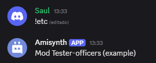

# $userRoles[]


Obtiene los roles de un usuario y los devuelve como una lista, usando el separador definido y el formato especificado.

## Sintaxis
```
$userRoles[Separador; Opción]
```


### Parámetros
- `Separador` `(Tipo: Texto || Indicador: Obligatorio)`: El carácter o texto que se usará para separar los roles en la salida.  
  Ejemplos comunes: `, ` `|` `\n`

- `Opción` `(Tipo: Texto || Indicador: Obligatorio)`: Define el tipo de dato que se devolverá.  
  Valores válidos:
  - `"names"` → Devuelve los nombres de los roles.
  - `"ids"` → Devuelve los IDs de los roles.


**Ejemplo 1: Obtener nombres de roles separados por coma**
```
$userRoles[-;names]
```
**Resultado:** `Mod Tester-officers (example)`




> La lista de roles se ordena de mayor a menor jerarquía según Discord (de arriba hacia abajo).  
> Solo se mostrarán los roles visibles para el bot o sistema, y no se incluye `@everyone`.

> Esta función es útil para mostrar permisos, exportar roles, o realizar validaciones de acceso.


