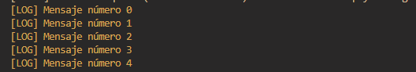

# $while[]

Ejecuta un bloque de código de manera repetitiva mientras la condición sea verdadera.  
Esta función permite crear bucles condicionales en tu sistema.


## Sintaxis 
```
$while[Condición; Código a ejecutar]
```

### Parámetros 

- `Condición` `(Tipo: Booleano || Indicador: Obligatorio)`: La condición que debe ser verdadera (`True`) para que el código dentro del bloque se ejecute. Si la condición es `False`, el bloque de código no se ejecutará.

- `Código a ejecutar` `(Tipo: Código/Texto || Indicador: Obligatorio)`: El bloque de código o instrucciones que se ejecutarán repetidamente mientras la condición sea `True`.


### Ejemplo 1: Bucle simple que imprime un mensaje 5 veces**
```
$let[contador;0]
$while[$get[contador] < 5; 
   $print[Mensaje número $get[contador]]
   $let[contador;$sum[$get[contador];1]]
]
```
**Resultado en consola:**  
```
Mensaje número 0  
Mensaje número 1  
Mensaje número 2  
Mensaje número 3  
Mensaje número 4
```




> Asegúrate de que la condición eventualmente cambie a `False`, de lo contrario, el bucle puede ejecutarse infinitamente y causar un bloqueo o sobrecarga del sistema.  
> Esta función es útil para procesos repetitivos como conteos, verificaciones o temporizadores.

> Es recomendable usarla con cuidado, especialmente si la condición es muy amplia o puede quedarse en `True` indefinidamente.
