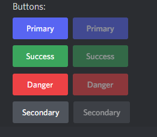
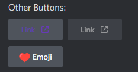
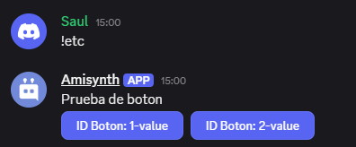
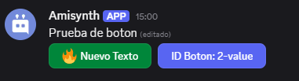
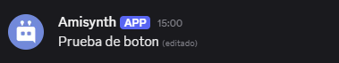
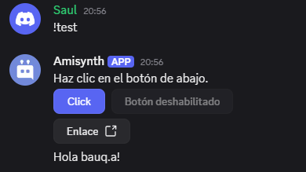

# Botones
En esta sección, aprenderá a usar el componente de botón.

## Contenido
[**Funciones utilizadas**](#functions-used) > [**Estilo de botón**](#button-style) > [**Tipo de botón**](#button-type) > [**$addButton[]**](#addbutton) > [**$editButton[]**](#editbutton) > [**$removeButtons[]**](#removebuttons-1) > [**$removeComponent[]**](#removecomponent) > [**Crear interacción**](#create-interaction)

## Funciones utilizadas

- [`$addButton[]`](../funciones/addButton.md)

- [`$editButton[]`](../funciones/editButton.md)

- [`$removeButtons[]`](../funciones/removeButtonsComplex.md)

- [`$removeComponent[]`](../funciones/removeComponent.md)

- [`$onInteraction`](../Eventos//callbacks/onInteraction.md)


## Estilo de botón
Los botones pueden tener diferentes estilos _(colores de fondo)_.
Aquí se muestran todos los valores posibles para el argumento de la función `style`.

- `primary` - Botón azul

- `secondary` - Botón gris

- `success` - Botón verde

- `danger` - Botón rojo

- `link` - Botón de redirección





> Si se usa el estilo `link`, el botón **no enviará** ninguna interacción.

## Tipo de botón
Existen dos tipos de botones: `interactivo` y `link`.

Al pulsar un botón interactivo, se envía una interacción que puede usarse junto con `$onInteraction`.

Cada botón interactivo tiene un `ID`. Una devolución de llamada `$onInteraction` solo se activará al presionar el botón con el mismo `ID`.
Los botones interactivos pueden usar todos los `style` excepto `link`.

> Los botones de enlace **no envían** interacciones. Al presionarlos, redirigen al usuario a un sitio web.
>
> Los botones de enlace **deben** establecer el valor del argumento `style` en `link`.

# $addButton[]

Agrega un botón al mensaje de respuesta.

## Sintaxis
```
$addButton[¿Nueva fila?;ID/URL de interacción;Etiqueta;Estilo;(¿Deshabilitar?;Emoji;ID del mensaje)]
```
### Parámetros
- `¿Nueva fila?` `(Tipo: Bool || Marca: Obligatorio)`: Si se establece en `yes`, el botón aparecerá en una nueva fila. Si se establece en `no`, el botón aparecerá en la misma fila que el botón anterior.

Un mensaje puede tener un máximo de 25 botones (5 filas de 5 botones).

- `ID de interacción/URL` `(Tipo: Cadena, URL || Indicador: Obligatorio)`: Según el tipo de botón, se puede configurar como `ID de interacción`, que se utiliza en la devolución de llamada  `$onInteraction`, o como `URL` si se trata de un botón de enlace.

No se necesita `$onInteraction` para la URL.

- `Etiqueta` `(Tipo: Cadena || Indicador: Vaciable)`: El texto visible en el botón.

- `Estilo` `(Tipo: Enumeración || Indicador: Obligatorio)`: Se utiliza para especificar el color de fondo del botón. Si el botón tiene un enlace/URL, **debe** configurar este valor como `link`. Consulte [esta sección](#button-style) para obtener más información. - `¿Desactivar?` `(Tipo: Bool || Marca: Vacantable)`: Si se establece en `sí`, el botón no se puede presionar. El valor predeterminado es `no`.


- `Emoji` `(Tipo: Emoji || Marca: Vacantable)`: Agrega un emoji dentro del botón. Los emojis deben pegarse como *unicode* o tener el siguiente formato `<:emoji name:emoji ID>`.

- `ID de mensaje` `(Tipo: Copo de nieve || Marca: Vacantable)`: Agrega un botón al ID de mensaje proporcionado. Es importante tener en cuenta que el autor del ID de mensaje proporcionado **debe** ser el bot.

> Los botones interactivos no pueden tener `ID` duplicados en el mismo mensaje. Por ejemplo, no se pueden tener dos botones con el ID establecido en `test`.

Si se usa `URL` en el argumento `ID de interacción/URL`, **debe** empezar con `http://` o `https://`


**Ejemplo**
```
Test
$addButton[false;value;Prueba de boton;primary;false]
```


# $editButton[]
Edita un botón existente.

## Sintaxis
```
$editButton[ID/URL de interacción; Etiqueta; Estilo; (¿Deshabilitar?; Emoji; ID del mensaje)]
```

### Parámetros

- `ID/URL de interacción` `(Tipo: Cadena, URL || Marca: Obligatorio)`: Según el tipo de botón, se establece como un `ID de interacción`, que se utiliza en la devolución de llamada `$onInteraction[ID de interacción]`, o como una `URL` si se trata de un botón de enlace.

- `Etiqueta` `(Tipo: Cadena || Marca: Vaciable)`: El texto visible en el botón.

- `Style` `(Type: Enum || Flag: Required)`: Se utiliza para especificar el color de fondo del botón. Si el botón tiene un enlace/URL, **debe** establecer este valor en `link`. Consulte [esta sección](#button-style) para obtener más detalles.

- `Disable?` `(Type: Bool || Flag: Vacantable)`: Si se establece en `yes`, el botón no se puede presionar. El valor predeterminado es `no`. _(Opcional)_

- `Emoji` `(Type: Emoji || Flag: Vacantable)`: Edita un emoji dentro del botón. Los emojis deben pegarse como *unicode* o tener el siguiente formato `<:emoji name:emoji ID>`. _(Opcional)_

- `Message ID` `(Type: Snowflake || Flag: Vacantable)`: Edita un botón en un mensaje con el ID proporcionado. Es importante tener en cuenta que el autor del ID del mensaje proporcionado **debe** ser el bot. _(Opcional)_

## Ejemplo
#### Desencadenador: `$onInteraction`


```
$editButton[test;Nuevo Texto;success;true;🔥;1358169514323480982]
```






# $removeButtons[]
Elimina todos los botones del mensaje especificado. ## Sintaxis
```
$removeButtons[ID del mensaje]
```
### Parámetros

- `ID del mensaje` `(Tipo: Copo de nieve || Marca: Obligatorio)`: Elimina los botones del mensaje con el ID proporcionado. Es importante tener en cuenta que el autor del ID del mensaje **debe** ser el bot.

## Ejemplo
```
$removeButtons[1358169514323480982]
```




# $removeComponent[]
Elimina un componente específico de un mensaje. ## Sintaxis
```
$removeComponent[ID/URL de interacción;(ID del mensaje)]
```
> Esta función admite [select-menu](../selectMenus/aboutSelectMenu.md) y [button](../gen/Botones.md).


### Parámetros
- `ID/URL de interacción` `(Tipo: Cadena || Marca: Obligatorio)`: El ID de interacción del botón que se eliminará del mensaje, establece `-1` para eliminar todos los compenentes (Incluye Select Menus).

- `ID del mensaje` `(Tipo: Copo de nieve || Marca: Vacante)`: Elimina el botón del mensaje con el ID proporcionado. Es importante tener en cuenta que el autor del ID del mensaje **debe** ser el bot. _(Opcional)_
## Ejemplo
```
$removeComponent[-1;1358169514323480982]
```


# Crear interacción
### Ejemplo con la devolución de llamada `$onInteraction`:
1. Cree dos comandos con los activadores `!example` y `$onInteraction`.

2. Pegue el siguiente código:
Código del comando con el disparador `!example`:
```
$nomention
¡Haga clic en el botón de abajo!
$addButton[no;test;Click;primary]
$addButton[no;button;Button disabled;secondary;yes]
$addButton[yes;https://botdesignerdiscord.com/;Link;link]
```
Código del comando con el disparador `$onInteraction`:
```
$editButton[test;Clicked;danger;yes]
$sendMessage[$username hello!]
```



> Tenga en cuenta que el ID de interacción proporcionado en `$onInteraction` es el mismo que el proporcionado en `$addButton[]`.
>
> En `$addButton[]`, `true` se usa para el argumento `new row?` para que el botón aparezca en la siguiente fila. 3. Ejecuta el comando `!example`


### Ejemplo con la devolución de llamada `$onInteraction`:
1. Crea dos comandos con los disparadores `!test` y `$onInteraction`.
2. Pega el siguiente código:
Código para el comando con el disparador `!test`:
```
Haz clic en el botón de abajo.
$addButton[false;prueba;Clic;primary]
$addButton[false;botón;Botón deshabilitado;secondary;true]
$addButton[true;https://botdesignerdiscord.com/;Enlace;link]
```
Código para el nombre del evento `$onInteraction`:
```python
bot = ..

bot.new_event("$onInteraction", 
              """
$if[$checkCondition[$customID[]==prueba];
$editButton[prueba;Clicked;danger;true;;$messageID[]]
$sendMessage[Hola $username[]!]
;]
               """)

bot.run(..)
```
> Tenga en cuenta que el ID de interacción devuelto por `$customID[]` será tEl mismo que el proporcionado en `$addButton[]`
>
> En `$addButton[]`, se usa `true` para el argumento `new row?` para que el botón aparezca en la siguiente fila.

3. Ejecutar el comando `!test`


> ¿Cómo funcionan [`$onInteraction`](../Eventos/onInteraction.md)?