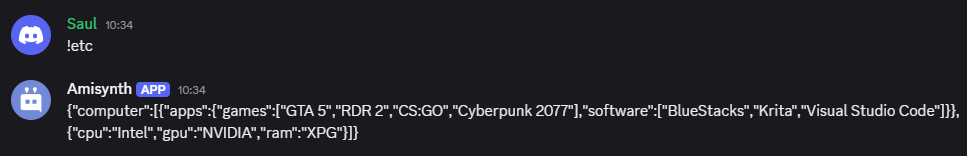
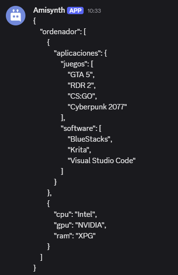
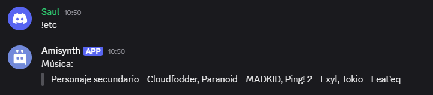

# JSON Funciones

Antes de leer esta guía, deberías estar familiarizado con JSON y dónde y cómo se utiliza. Puedes familiarizarte con JSON leyendo un tutorial en [Mozzilla](https://developer.mozilla.org/es/docs/Learn_web_development/Core/Scripting/JSON).

## Funciones utilizadas 

- [`$jsonParse[]`](/funciones/jsonParse.md)

- [`$json[]`](/funciones/json.md)

- [`$jsonSet[]`](/funciones/jsonSet.md)

- [`$jsonSetString[]`](/funciones/jsonSetString.md)

- [`$jsonUnSet[]`](/funciones/jsonUnSet.md)

- [`$jsonClear[]`](/funciones/jsonClear.md)

- [`$jsonExists[]`](/funciones/jsonExists.md)

- [`$jsonStringify[]`](/funciones/jsonStringify.md)

- [`$jsonPretty[]`](/funciones/jsonPretty.md)

- [`$jsonArray[]`](/funciones/jsonArray.md)

- [`$jsonArrayCount[]`](/funciones/jsonArrayCount.md)

- [`$jsonArrayIndex[]`](/funciones/jsonArrayIndex.md)

- [`$jsonArrayAppend[]`](/funciones/jsonArrayAppend.md)

- [`$jsonArrayPop[]`](/funciones/jsonArrayPop.md)

- [`$jsonArrayShift[]`](/funciones/jsonArrayShift.md)

- [`$jsonArrayUnShift[]`](/funciones/jsonArrayUnShift.md)

- [`$jsonArraySort[]`](/funciones/jsonArraySort.md)

- [`$jsonArrayReverse[]`](/funciones/jsonArrayReverse.md)

- [`$jsonJoinArray[]`](/funciones/jsonJoinArray.md)


## $jsonParse[]

`$jsonParse` es la función principal utilizada cuando se trabaja con datos JSON.  
Esta función analiza una cadena JSON y la convierte en un objeto que luego puede ser utilizado por otras funciones JSON.  

**Sintaxis**
```plaintext
$jsonParse[JSON string]
```
> Solo puede usar para claves y valores en str este tipo de comilla: `'`

**Parámetros**
- `JSON string` *(Tipo: String || Obligatorio)*: La cadena JSON que se analizará y convertirá en un objeto.  

**Ejemplo:**

```
JSON guardado. $jsonParse[{'numero': 100}]
```


## $json[]
La función $json recupera valores JSON de una clave especificada en el objeto JSON actual.

> La función $json devolverá una cadena vacía si el valor es nulo, la clave no existe, no se ejecutaron las funciones $jsonParse o $jsonSet, o se ejecutó $jsonClear.

Sintaxis
```
$json[Key;...]
```
Parámetros

- `Key` `(Tipo: String || Flag: Required)`: La clave JSON que se recuperará.

Ejemplos
```
# Sin arrays

$jsonParse[{
    'username': 'Izana',
    'tag': '6700',
    'identity': {
        'age': 16
        }
    }]

Nombre de usuario: $json[username]
Etiqueta: $json[tag]
Edad: $json[identity;age] años
```


## $jsonSet[]  
La función `$jsonSet` establece o reemplaza el valor en la clave JSON especificada.  

**Sintaxis**  
```plaintext
$jsonSet[Key;...;Value]
```

**Parámetros**  
- `Key` `(Tipo: String || Obligatorio)`: La clave JSON donde se establecerá o reemplazará el valor.  
- `Value` `(Tipo: Integer, Bool, Float, String || Obligatorio)`: El valor que se asignará o reemplazará en la clave especificada.  

**Ejemplo**  
```plaintext
$jsonParse[{
    'username': 'Izana',
    'tag': "6700",
    'identity': {
        'age': 16
    }
}]

Nombre de usuario: $json[username]  
Etiqueta: $json[tag]  
Edad: $json[identity;age] años  

$jsonSet[username;Priyanuj]  
$jsonSet[tag;2626]  
$jsonSet[identity;age;19]  


Nombre de usuario: $json[username]  
Etiqueta: $json[tag]  
Edad: $json[identity;age] años
```  


## $jsonSetString[]
La función `$jsonSetString` establece o reemplaza el valor en la clave JSON especificada. Siempre establece el valor como una cadena.  

**Sintaxis** 
```plaintext
$jsonSetString[Key;...;Value]
```

**Parámetros**
- `Key` `(Tipo: String || Flag: Required)`: La clave JSON donde se establecerá o reemplazará el valor.  

- `Value` `(Tipo: String || Flag: Required)`: El valor a establecer o reemplazar.  

> Esta función se recomienda principalmente para comandos relacionados con economía.  

**Ejemplo**
```plaintext
$nomention
$jsonParse[{}]

$jsonSet[balance;$message]

Balance key was set to: $json[balance]
```


Usando `$jsonSetString`  
```plaintext
$nomention
$jsonParse[{}]

$jsonSetString[balance;$message]

Balance key was set to: $json[balance]
```


## $jsonUnset[]  
La función `$jsonUnset` elimina el valor en la clave JSON especificada.  
En resumen, es la función opuesta a `$jsonSet`.  

**Sintaxis**
```plaintext
$jsonUnset[Key;...]
```

**Parámetros**
- `Key` `(Tipo: String || Flag: Required)`: La clave JSON que se eliminará.  

**Ejemplo**
```plaintext
$jsonParse[{
    "username": "NightNutSky",
    "tag": "6700",
    "identity": {
        "age": 16
    }
}]

Username: $json[username]
Tag: $json[tag]
Age: $json[identity;age] years old

$jsonUnset[username]
$jsonUnset[tag]
$jsonUnset[identity;age]

$optOff[Username: $json[username]
Tag: $json[tag]
Age: $json[identity;age] years old]
```


## $jsonClear[]
La función `$jsonClear` elimina el objeto JSON actual, restableciendo su contenido.  

**Sintaxis**  
```plaintext
$jsonClear[]
```

**Ejemplo**  
```plaintext
$jsonParse[{
    'username': 'Izana',
    'tag': '6700',
    'identity': {
        'age': 16
        }
    }]
Nombre de usuario: $json[username]  
$jsonClear[]
Nombre de usuario: $json[username]
```  


## $jsonExists[]
La función `$jsonExists` verifica si una clave JSON especificada existe en el objeto JSON actual.  

> Devuelve un resultado vacío si no se ejecutaron las funciones `$jsonParse` o `$jsonSet`, o si se ejecutó `$jsonClear`.  

**Sintaxis**  
```plaintext
$jsonExists[Key;...]
```

**Parámetros**  
- `Key` `(Tipo: String || Flag: Required)`: La clave JSON que se verificará.  

**Ejemplo**  

```
$jsonParse[{
    'user': {
        'name': 'Amisadai',
        'age': 20
    }
}]

$jsonExists[user;name] ✅ La clave 'name' existe.
$jsonExists[user;email] ❌ La clave 'email' no existe.
```  


## $jsonStringify[]
La función `$jsonStringify[]` convierte el objeto JSON actual en una cadena de texto.  

> La función `$jsonStringify[]` devolverá una cadena vacía si no se ejecutaron las funciones `$jsonParse` o `$jsonSet`, o si se ejecutó `$jsonClear`.  

**Sintaxis**  
```plaintext
$jsonStringify[]
```

**Ejemplo**  
```plaintext

$jsonParse[{
    'computer': [{
        'apps': {
            'software': ['BlueStacks', 'Krita', 'Visual Studio Code'],
            'games': ['GTA 5', 'RDR 2', 'CS:GO', 'Cyberpunk 2077']
        }
    },{
        'cpu': 'Intel',
        'gpu': 'NVIDIA',
        'ram': 'XPG'
    }]
}]

$jsonStringify[]
```




## $jsonPretty[]
La función `$jsonPretty` convierte el objeto JSON actual en una cadena formateada con sangría para una mejor visualización.  

> La función `$jsonPretty` devolverá un resultado vacío si no se ejecutaron las funciones `$jsonParse` o `$jsonSet`, o si se ejecutó `$jsonClear`.  

**Sintaxis**
```plaintext
$jsonPretty[Indent length]
```

**Parámetros**
- `Indent length` `(Tipo: Integer || Flag: Required)`: La cantidad de espacios usados para la indentación. Generalmente es `2` o `4`.  

**Ejemplo** 
```plaintext
$nomention
$disableInnerSpaceRemoval
$jsonParse[{
    'ordenador': [{
        'aplicaciones': {
            'software': ['BlueStacks', 'Krita', 'Visual Studio Code'],
            'games': ['GTA 5', 'RDR 2', 'CS:GO', 'Cyberpunk 2077']
        }
    },{
        'cpu': 'Intel',
        'gpu': 'NVIDIA',
        'ram': 'XPG'
    }]
}]

$jsonPretty[4]
```



## $jsonArray []
La función `$jsonArray` marca una clave JSON especificada como un **array**.  

**Sintaxis**  
```plaintext
$jsonArray[Key;...]
```

**Parámetros**  
- `Key` `(Tipo: String || Obligatorio)`: La clave JSON que será marcada como un array.  

**Ejemplo**  
```plaintext

$jsonParse[{
    'games': ''
}]

Clave `games` sin array:  
$jsonPretty[4]  

$jsonArray[games]  

Clave `games` convertida en array:  
$jsonPretty[4]  
```


## $jsonArrayCount[]
La función `$jsonArrayCount` cuenta los elementos en la clave JSON especificada.  

**Sintaxis**  
```plaintext
$jsonArrayCount[Key;...]
```

**Parámetros**  
- `key` `(Tipo: String || Obligatorio)` La clave JSON donde se contarán los elementos.  

**Ejemplo**  
```plaintext

$jsonParse[{
    'computer': [{
        'apps': {
            'software': ['BlueStacks', 'Krita', 'Visual Studio Code'],
            "games": ['GTA 5', 'RDR 2', 'CS:GO', 'Cyberpunk 2077']
        }
    },{
        'cpu': 'Intel',
        'gpu': 'NVIDIA',
        'ram': 'XPG'
    }]
}]

$onlyIf[$checkCondition[$jsonExists[computer;0;apps;$message[-1]]==true];¡La categoría especificada no existe! Categorías disponibles: `software` y `games`]

La cantidad de aplicaciones en `$message[-1]` es: $jsonArrayCount[computer;0;apps;$message[-1]].
```  


## $jsonArrayIndex[]

La función `$jsonArrayIndex` obtiene el índice de un valor dentro de un array JSON.  

> La función `$jsonArrayIndex` devolverá `-1` si el valor no se encuentra y devolverá un resultado vacío si no se ejecutaron `$jsonParse` o `$jsonSet`, o si se ejecutó `$jsonClear`.  

**Sintaxis**  
```plaintext
$jsonArrayIndex[Key;...;Value]
```

**Parámetros**  
- `key` `(Tipo: String || Obligatorio)` La clave JSON donde se buscará el valor.  

- `value` `(Tipo: String, Integer, Float || Obligatorio)` El valor a buscar dentro del array.  

**Ejemplo**  
```plaintext
$jsonParse[{
    'computer': [{
        'apps': {
            'software': ['BlueStacks', 'Krita', 'Visual Studio Code'],
            "games": ['GTA 5', 'RDR 2', 'CS:GO', 'Cyberpunk 2077']
        }
    },{
        'cpu': 'Intel',
        'gpu': 'NVIDIA',
        'ram': 'XPG'
    }]
}]


El índice de `$message[-1]` en `apps/software` es: $jsonArrayIndex[computer;0;apps;software;$message[-1]].
```  


## $jsonArrayAppend[]
La función `$jsonArrayAppend` agrega un valor al final de la clave JSON especificada.  

**Sintaxis**  
```plaintext
$jsonArrayAppend[Key;...;Value]
```

**Parámetros**  
- `key` `(Tipo: String || Obligatorio)` La clave JSON donde se agregará el valor.  

- `value` `(Tipo: Integer, Bool, Float, String || Obligatorio)` El valor que se agregará al final del array.  

**Ejemplo**  
```plaintext
$jsonParse[{
    'computer': [{
        'apps': {
            'software': ['BlueStacks', 'Krita', 'Visual Studio Code'],
            'games': ['GTA 5', 'RDR 2', 'CS:GO', 'Cyberpunk 2077']
        }
    },{
        'cpu': 'Intel',
        'gpu': 'NVIDIA',
        'ram': 'XPG'
    }]
}]

$onlyIf[$checkCondtion[$jsonExists[computer;0;apps;$message[1]]==true];¡La categoría especificada no existe! Categorías disponibles: `software` y `games`]

$let[value;$replaceText[$message[-1];$message[1];]]

$jsonArrayAppend[computer;0;apps;$message[1];$get[value]]

¡Se agregó una nueva aplicación a la categoría `$message[1]`!  
Aplicaciones actuales en la categoría `$message[1]`: $json[computer;0;apps;$message[1]]
```  


## $jsonArrayPop[]
La función `$jsonArrayPop` elimina el último elemento de un array y devuelve el elemento eliminado.  

**Sintaxis**  
```plaintext
$jsonArrayPop[Key;...]
```

**Parámetros**  
- `key` `(Tipo: String || Obligatorio)` La clave del array del cual se eliminará un elemento.  

**Ejemplo**  
```plaintext
$jsonParse[{
    'music': ['Paranoid - MADKID', 'Ping! 2 - Exyl', 'Tokyo - Leat'eq']
}]

Eliminado: $jsonArrayPop[musica]

Música actual:
> $jsonJoinArray[musica;, ]
```  


## $jsonArrayShift[]
La función `$jsonArrayShift[]` elimina el primer elemento de un array y devuelve el elemento eliminado.  

**Sintaxis**  
```plaintext
$jsonArrayShift[Key;...]
```

**Parámetros**  
- `key` `(Tipo: String || Obligatorio)` La clave del array del cual se eliminará un elemento.  

**Ejemplo**  
```plaintext
$jsonParse[{
    'music': ['Paranoid - MADKID', 'Ping! 2 - Exyl', 'Tokyo - Leateq']
}]

Eliminado: $jsonArrayShift[music]

Música actual:
> $jsonJoinArray[music;, ]
```  


## $jsonArrayUnshift[]
La función `$jsonArrayUnshift` agrega un valor al inicio de un array JSON.  

**Sintaxis**  
```plaintext
$jsonArrayUnshift[Key;...;Value]
```

**Parámetros**  
- `key` `(Tipo: String || Requerido)` La clave del array JSON donde se añadirá el valor.  

- `value` `(Tipo: Float, String, Bool, Integer || Requerido)` El valor que se agregará al inicio del array.  

**Ejemplo**  
```plaintext
$jsonParse[{
    'music': ['Paranoid - MADKID', 'Ping! 2 - Exyl, 'Tokyo - Leat'eq]
}]

$jsonArrayUnshift[music;Side Character - Cloudfodder]

Música:
> $jsonJoinArray[music;, ]
```  





## $jsonArraySort[]

La función `$jsonArraySort` ordena un array JSON específico en orden ascendente.  

> La función ordena los elementos en el siguiente orden:  
> 1. Números enteros de menor a mayor.  
> 2. Cadenas de texto basadas en sus valores ASCII/Unicode.  

**Sintaxis**  
```plaintext
$jsonArraySort[Key;...]
```

**Parámetros**  
- `key` `(Tipo: String || Opcional)` La clave del array JSON que se ordenará.  

**Ejemplo**  
```plaintext
$jsonParse[{
  'data': ['Oranges', 'banana', 10, 'apple', 'Apples', 2, 30]
}]

$jsonArraySort[data]

Después de ordenar:
> $json[data]
```  


## $jsonArrayReverse[]
La función `$jsonArrayReverse` invierte el orden de un array JSON específico.  

**Sintaxis**  
```plaintext
$jsonArrayReverse[Key;...]
```

**Parámetros**  
- `key` `(Tipo: String || Opcional)` La clave del array JSON que se invertirá.  

**Ejemplo**  
```plaintext

$jsonParse[{
  'fruits': ['apple', 'orange', 'banana', 'grape']
}]

$jsonArrayReverse[fruits]

Después de invertir:
> $json[fruits]
```  


## $jsonJoinArray[]  
La función `$jsonJoinArray` une un array JSON bajo la clave especificada utilizando el separador dado.  

> La función `$jsonJoinArray` devolverá una cadena vacía si el valor es `null`, la clave no existe, no se ejecutaron las funciones `$jsonParse` o `$jsonSet`, o si se ejecutó `$jsonClear`.  

**Sintaxis**  
```plaintext
$jsonJoinArray[Key;...;Separator]
```

**Parámetros**  
- `Key` `(Tipo: String || Flag: Required)`: La clave JSON que apunta a un array que será recuperado.  
- `Separator` `(Tipo: String || Flag: Required)`: El separador que se utilizará para unir los elementos del array.  

**Ejemplo**  
```plaintext

$jsonParse[{
    'music': ['Paranoid - MADKID', 'Ping! 2 - Exyl', 'Tokyo - Leat\'eq']
}]

Music:
> $jsonJoinArray[music;, ]
```

