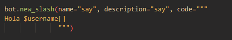
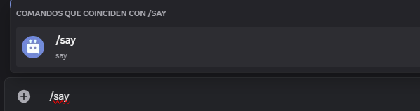
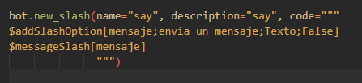
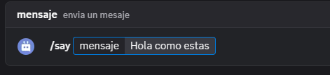
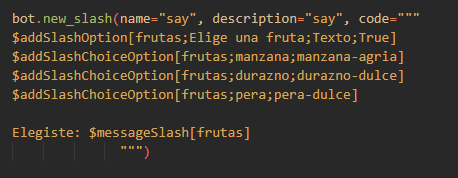
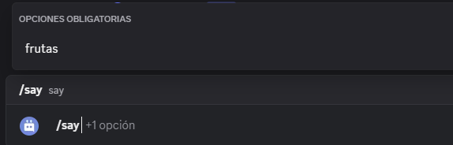
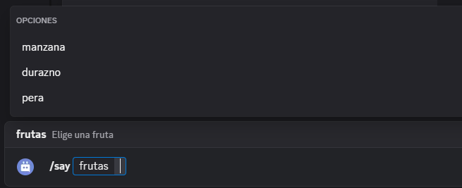

# Comandos de barra
En esta guía, aprenderás más sobre cómo implementar comandos de barra en tu bot.

Los comandos de barra son un tipo de comandos interactivos de aplicación. Permiten a los usuarios interactuar con tu bot escribiendo `/<nombre del comando>`.


# Información general
- Discord permite hasta 200 comandos de barra (100 globales y 100 de gremio).
- Para usar comandos de barra, debes invitar al bot con el alcance `applications.commands`.
- Crear, modificar o eliminar comandos de barra globales puede tardar hasta **1 hora**.
- Crear un comando de barra de gremio es instantáneo, pero no aparecerá a menos que lo hayas registrado en el gremio actual mediante la función `$registerGuildCommands[(nombre del comando de barra;...)]`.

> 📝 Los comandos de barra de clan no aparecen en los mensajes directos, a diferencia de los comandos de barra globales.
# Primeros pasos


## Invitar al bot
- Método 1
- Visita el sitio web oficial de [Discord Developer](https://discord.com/developers/applications) y selecciona la aplicación para tu bot.
- Haz clic en el icono de hamburguesa `≡` en la esquina superior izquierda del sitio web y selecciona la pestaña `OAuth2`.
- En la pestaña `OAuth2`, haz clic en la subpestaña `Generador de URL`.
- Selecciona `bot` y `application.commands` en los ámbitos y permisos deseados para el bot.
- Copia la URL generada a continuación e invita a tu bot a tu servidor.

- Método 2
- Abre la aplicación BDFD y selecciona tu bot.
- Pulsa el botón `Añadir invitación de bot al servidor` en la pestaña del panel. - Haz clic en "Editar ámbitos de enlace de invitación" y habilita "Comandos de barra" si está deshabilitado.
- Ahora, regresa y presiona "Agregar tu bot a tu servidor".
- Finalmente, invita al bot a tu servidor.

## Crear un comando de barra
- Crea o modifica un comando existente.
- Haz clic en "Activador de comando de barra".
- Elige "Habilitar comando de barra global" o "Habilitar comando de barra de gremio", según tus preferencias.
- Completa los datos necesarios y guárdalos.

> 📝 Los comandos de barra pueden tener un máximo de 4000 caracteres (nombre, descripción y propiedades de valor combinadas) por barra.

### Ejemplo






## Opciones de barra diagonal
Las opciones de barra diagonal son una excelente manera de obtener la entrada del usuario en los comandos de barra diagonal.

Para crear una opción de barra diagonal:
- Abra la página de edición del disparador del comando de barra diagonal.
- Haga clic en el botón *"Añadir"* en la sección "Opciones".
- Complete los datos necesarios y guarde los cambios.

> 📝 Los comandos de barra pueden tener hasta 25 opciones por barra.

### Tipos de opciones de barra

- Texto: Acepta cualquier cadena de caracteres.
- Entero: Acepta solo valores enteros. Por ejemplo: 3, -70, etc.
- Número: Acepta solo valores numéricos. Por ejemplo: 5.3, -35, 23, etc.
- Booleano: Acepta valores verdaderos o falsos.
- Usuario: Permite mencionar a cualquier usuario.
- Canal: Permite mencionar a cualquier canal.
- Rol: Permite mencionar a cualquier rol.
- Mencionable: Permite mencionar a cualquier usuario o rol.
- Archivos adjuntos: Permite subir archivos adjuntos.

### Recuperar valor de las opciones
Para recuperar el valor de una opción, utilice `$messageSlash[<nombre de la opción>]`.

> 📝 Si quieres que esta función funcione tanto con comandos normales como con comandos de barra diagonal, puedes usar `$messageSlash[<option name>]`.

#### Ejemplo





## Opciones predefinidas

Para crear opciones:
- En la página de edición del disparador de comandos de barra diagonal, cree una opción y complete los datos necesarios.
- Active la opción *"Habilitado"* en la sección "Opciones predefinidas".
- Luego, haga clic en el botón *"Agregar una nueva opción"*.
- Escriba el nombre y el valor de la opción. - Haga clic en *"Añadir"* y guarde los cambios.

> 📝 Un comando de barra diagonal puede tener hasta 25 opciones por opción.

### Recuperación de opciones
Puede recuperar las opciones del usuario mediante sentencias `$if`.

#### Formato
```python
bot  = ..

bot.new_slash(name="say", description="say", code="""
$addSlashOption[frutas;Elige una fruta;Texto;True] 
$addSlashChoiceOption[frutas;manzana;manzana-agria]
$addSlashChoiceOption[frutas;durazno;durazno-dulce]
$addSlashChoiceOption[frutas;pera;pera-dulce]
                      
Elegiste: $messageSlash[frutas]
              """)

bot.run(..)
```

Ejemplo




